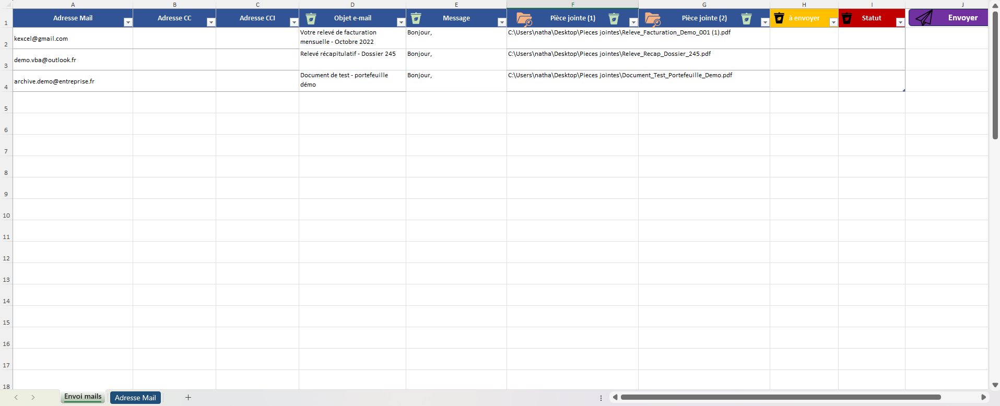
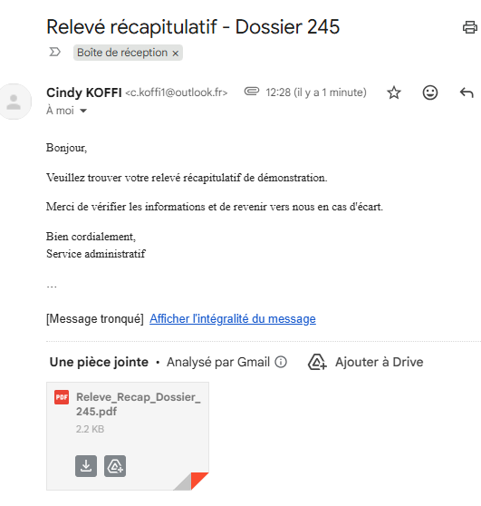

# Automatisation des e-mails avec Excel VBA

## Objectif
Ce projet reproduit un cas simple d’automatisation métier : envoyer plusieurs e-mails avec pièces jointes depuis un fichier Excel via Outlook.

## Contexte
Ce projet a été reconstruit à partir d’un cas concret d’automatisation d’une tâche répétitive : l’envoi d’e-mails à plusieurs destinataires avec pièces jointes.

L’objectif est de démontrer une première logique d’automatisation appliquée à un besoin métier simple et structuré.

## Fonctionnalités
- lecture des destinataires depuis Excel
- gestion des champs To / CC / CCI
- personnalisation de l’objet et du message
- ajout de pièces jointes
- envoi d’e-mails via Outlook
- mise à jour du statut d’envoi
- macros utilitaires pour effacer certaines colonnes
- sélection dynamique de fichiers pour les pièces jointes

## Technologies utilisées
- Excel
- VBA
- Outlook Desktop
- Git / GitHub

## Structure du projet
- `Envoi_Mails_VBA.xlsm` : fichier Excel principal
- `Module_Envoi_Mails.bas` : module VBA exporté
- `docs/` : documents PDF fictifs de démonstration
- `screenshots/` : captures de l’interface

## Captures
### Interface Excel

### Résultat dans Outlook

## Limites actuelles
- dépendance à Outlook classique
- gestion d’erreur simple
- interface volontairement basique

## Améliorations possibles
- journalisation des erreurs
- meilleure ergonomie de l’interface Excel
- gestion d’erreur plus robuste
- adaptation future en Python ou via API

## Auteur
Projet réalisé par Cindy K : Nereais
